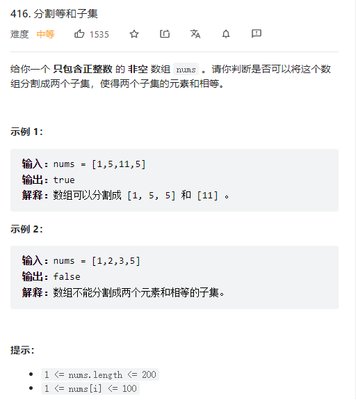
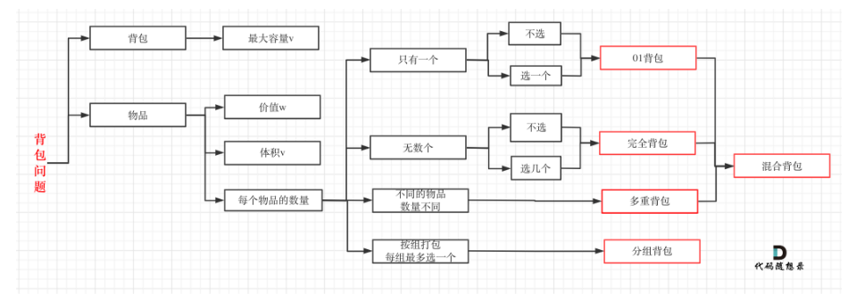
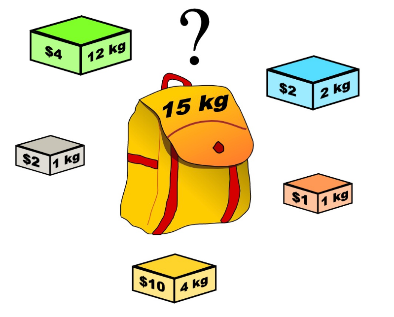
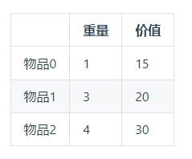
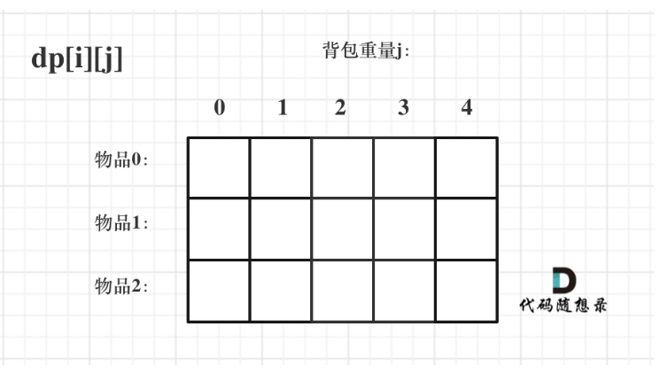
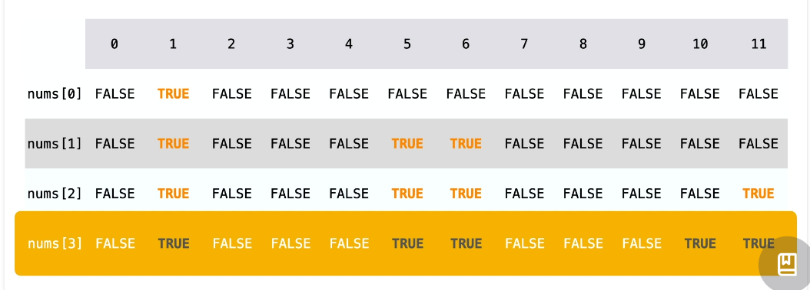

# AlgorithmItem

来源：力扣（LeetCode）
链接：https://leetcode.cn/problems/partition-equal-subset-sum/?favorite=2cktkvj
著作权归领扣网络所有。商业转载请联系官方授权，非商业转载请注明出处。

[0 - 1 背包问题]
https://programmercarl.com/%E8%83%8C%E5%8C%85%E7%90%86%E8%AE%BA%E5%9F%BA%E7%A1%8001%E8%83%8C%E5%8C%85-1.html#_01-%E8%83%8C%E5%8C%85

1、背包基础图与概念

有n件物品和一个最多能背重量为w 的背包。第i件物品的重量是weight[i]，得到的价值是value[i] 。每件物品只能用一次，求解将哪些物品装入背包里物品价值总和最大

在下面的讲解中，我举一个例子：
背包最大重量为4。
物品为：

2、二维dp数组状态转移图

dp[i][j]：表示从下标为[0-i]的物品里任意取，放进容量为j的背包，价值总和最大是多少，如下图所示：

3、本题中的二维dp数组状态转移图

dp[i][j]：表示从数组的[0,i]下标范围内选取若干个正整数（可以是0个),是否存在一种选取方案使得被选
取的正整数的和等于j;